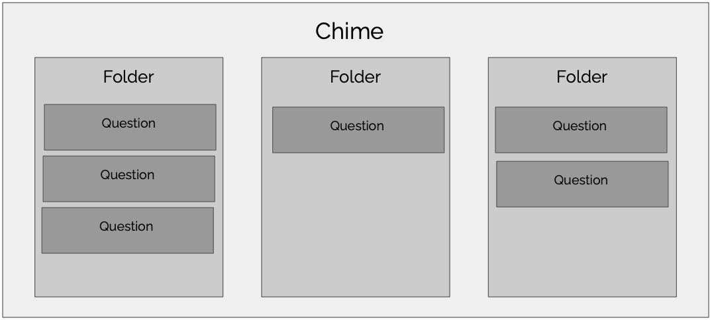

# Welcome to ChimeIn

[ChimeIn (chimein2.cla.umn.edu)](https://chimein2.cla.umn.edu) is a fast, flexible response tracking tool.  Think of it as a web-based "clicker" tool, but with advanced features that aren't possible with traditional clickers.  ChimeIn can be used in classes, but it can also be used for meetings, conferences, or any type of event in which you want to collect feedback.  ChimeIn can also be used both synchronously and asynchronously.  

::: tip Migrating from the original ChimeIn?  
Check out our [moving to ChimeIn 2](moving-to-chimein-2) page or [contact us](mailto:mcfa0086@umn.edu) for a personal introduction
:::

We've got an orientation video, which will cover all the basics. You can take a look below.

<iframe width="100%" height="415" src="https://www.youtube.com/embed/A1jmm6ckm3Y" frameborder="0" allow="accelerometer; autoplay; encrypted-media; gyroscope; picture-in-picture" allowfullscreen></iframe>

## ChimeIn Basics

ChimeIn organizes content into "Chimes".  Each Chime can contain one or more folders, and each folder can contain one or more questions.  To get started creating a Chime, just log in.  

Below is a diagram explaining how questions are organized. If you're using ChimeIn as part of a course, you'll probably have a "Chime" for each of your courses. Then you can create folders for each lecture or topic, or just create a single folder for your whole semester. 

## Chime access

Every Chime has a custom URL associated with it, as well as an access code.  These are visible by clicking the "Chime settings" button.  Participants can join your chime by going to the ChimeIn homepage and entering that access code, or by visiting the link.

You can optionally require that participants login in order to join your Chime.  This will allow you to see names associated with the responses, and will allow participants to access their previous responses.

