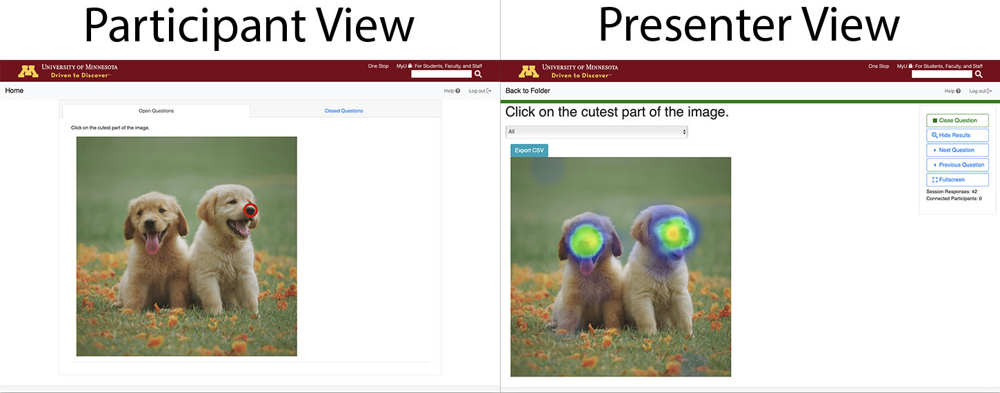
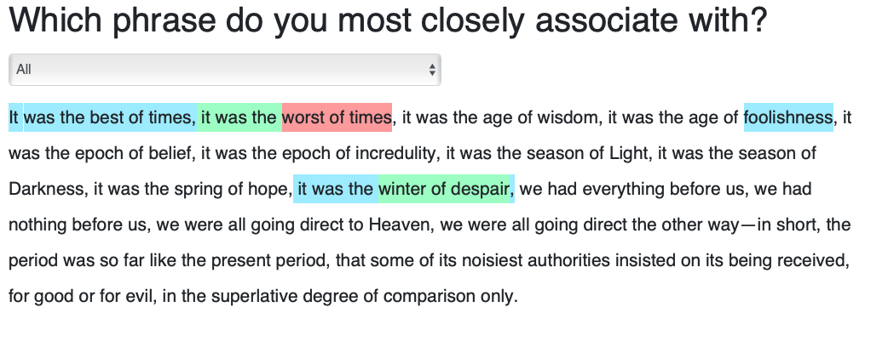

# Asking Questions with ChimeIn

ChimeIn offers multiple question types, including multiple choice, free response, slider response, and an image upload. Multiple choice and slider response questions are great choices for quick in class comprehension checks. They are easy to make quickly in class, and students can answer in a few seconds. Free response questions and image uploads require more time on the students’ part, so these options are great for reflecting on learning and even allowing students to answer the question outside of class. Questions with long prompts and/or long multiple choice answers should be prepared prior to the start of class to keep class running smoothly. If ChimeIn questions should appear in the Canvas gradebook, instructors should make ChimeIn assignments in [Canvas](canvas) before class. This process is fairly simple, but does take more time than just creating a question in class.

Questions can include links, images, numbered and bulleted lists, as well as standard typographical emphasis options, allowing for a wide variety of question options.

## Adding Questions

Questions are stored inside of folders. After you've created your first Folder, click the "new question" button to create a question.

## Anonymous Questions

You can choose to make questions anonymous. In this case, participant names won't be displayed in association with their responses. Keep in mind that identity information is still tracked on the ChimeIn server, so this is not an acceptable option for collecting truly anonymous data.

## Question Types

ChimeIn currently has 5 question types. The architecture of ChimeIn allows us to easily add new types of questions, so if you've got an idea for something cool, let us know.

### Multiple Choice

Multiple choice questions can easily be written in class and before class. Questions with short prompts and answers can be written in class, while questions with long prompts and detailed answers should be written prior to the start of class. If you check the box for "allow multiple responses", participants will be able to select more than one option.

You can **optionally** select a "correct" answer or answers for a question by checking the box to the left of the response text. The correct answer will be marked with a check in the results display. You can also [optionally have only correct answers passed to Canvas](managing-a-chime) when using the Canvas integration.

#### Written in class

- What year was the Chinese Exclusion Act passed?

  - 1885
  - 1882
  - 1892
  - 1888

- Alexander Hamilton was the first \_\_\_\_? (Answers read out loud, students select A, B, or C instead of reading answers in ChimeIn.

#### Written before class

- Which one is not one of the Universal Design for Learners assumptions and beliefs?

  - Disability is at the intersection where the individual interacts with the environment or context
  - Variability is the norm. If we design for the average, we design for no one
  - Finding solutions for each individual learner is essential for academic, social, and emotional growth
  - It is essential to remove barriers to learning through both design, and the inclusion of technology while maintaining high expectations of all learners

- Un poema incorpora símbolos, metáforas, y lenguaje figurativo para comunicar su mensaje. Empareja cada línea poética con su significado en lenguaje más directo: Dejaste las carnes festejando a Baco.
  - El “tú” quiere que sea pura y fresca como la mañana
  - Una persona que ha pasado la vida bebiendo y brindando
  - Hace referencia a la celebración griega en honor al diós del vino
  - Comparación entre flores que hace referencia a la frágilidad y pureza de la mujer

#### True/False

True/false questions are great ways to check comprehension. You can check the "True/false" box when making a multiple choice question to automatically fill in entries for True and False. These can easily be prepared both in and before class. Instructors can provide the prompt verbally and have students select true or false in ChimeIn for impromptu comprehension checks, or plan more detailed questions ahead of time.

- Is this [spoken claim] true or false? T/F
- Los trabajadores del Banco de Ahorros decidieron comprar juntos números de la lotería. T/F

### Slider

Slider response questions are great ways to check student understanding and confidence as well as collect linear information.

- How well do you understand [blank topic]? Scale: don’t understand at all - completely understand
- How much money did you spend on textbooks this semester? Scale: $0-$500

### Heatmap

A heatmap question allows you to upload an image and present it to your participants, along with a written prompt. They'll then be able to click or tap on the image to indicate a selected area, which will be rendered as a "heatmap" in the presenter view.

- Identify the problematic portion of a (HIPAA-respecting) medical slide or scan
- Flag a portion of a map in response to a geo question

### Text Heatmap

A text heatmap question allows you to present a written prompt along with a paragraph of text. Participants will highlight a portion of the text. The presenter view will show which sections of text are most frequently highlighted.

- Identify hyperbolic statements within a paragraph from a political speech
- Flag grammatical issues in a sample text in a language class

### Free Response

Free response questions allow students to write their own answers to questions. These answers can be a couple of words or entire paragraphs.

- What is one difference in the way that nomadic and sedentary societies before 1500 C.E. adapted to their environment?
- As conventional sources of crude oil are depleted, unconventional sources such as oil sands (also known as tar sands) are being utilized. Oils sands contain bitumen, which can be processed into a synthetic crude oil. A region of boreal forest in Alberta, Canada, that covers a deposit of oil sands will be cut and removed during the process of bitumen extraction.

  - Identify one ecological benefit, other than providing habitat, that is provided by forests.
  - Identify one economic benefit that is provided by forests.
  - Describe TWO environmental consequences, other than those related to the loss of boreal forest habitat, that result from the extraction of bitumen or the transportation of synthetic oil to customers.

- List at least three things is Fez, Morocco, famous for (think artistic and academic contributions over the ages)? Hint:

### Image Response

Image upload responses can be used both in class and out of class. An example for an in class submission could be submitting a picture of a filled out worksheet (this works for group work too!) and uploading it to ChimeIn. Another possibility is to have students go out and take pictures of things that are related to class.

- Take a picture of your work and submit it for full credit.
- Take a picture of an example of neoclassical architecture you see on campus. Submit your picture by 5pm on Tuesday.

## Question Sessions

Each time you open a question, a session is created to hold responses. When viewing results, you can use the dropdown to select between sessions. By default, results are aggregated and displayed.

The sessions feature allows you to ask a question multiple times, and compare the outcome from each session. For example, an instructor may ask a question at the beginning of a lecture and again at the end, to track whether opinions have changed.
