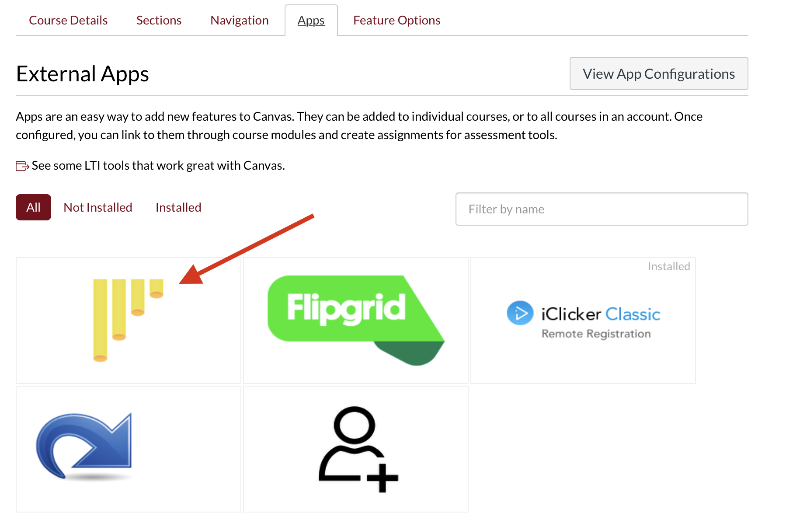
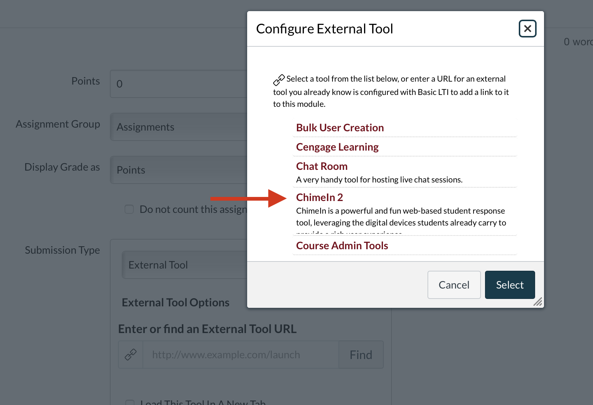

# Using ChimeIn in Canvas

ChimeIn has direct Canvas integration, which makes it easy to create and manage Chimes.  In addition, ChimeIn can share completion data back to the Canvas gradebook, allowing ChimeIn responses to be used to track attendance or participation.

## Enabling ChimeIn in your Canvas Course

ChimeIn needs to be enabled in your Canvas course.  Go to the "settings" link in your Canvas course and select "apps", then click the ChimeIn icon.

Some instructions will be presented.  **You'll need to copy and paste two values** - the "consumer key" and "secret key". It might be helpful to copy these to a temporary text document.  Once it's been enabled, you can begin adding ChimeIn assignments. 

This screencast shows the process.

<iframe width="560" height="315" src="https://www.youtube.com/embed/3sAjHC3onFM" frameborder="0" allow="accelerometer; autoplay; encrypted-media; gyroscope; picture-in-picture" allowfullscreen></iframe>

## Creating a Chime

ChimeIn is available as an "external tool" within the Canvas assignment tool.  When adding an assignment, select ChimeIn from the external tools list.  You can assign a grading basis as well.  **We recommend checking the box for "open in a new tab" so your students have plenty of space**.

After creating the assignment, click the link to open ChimeIn.  This will automatically create a new Chime within ChimeIn, and add a folder with the same name as your assignment.  Any future assignments you create will automatically have folders created in this Chime as well.  

Add any questions you'd like to your folder.  If you have co-instructors, they will automatically be granted the access to add questions as well. 

This screencast shows the process.

<iframe width="100%" height="420" src="https://www.youtube.com/embed/Vz-exmZVvzc" frameborder="0" allow="accelerometer; autoplay; encrypted-media; gyroscope; picture-in-picture" allowfullscreen></iframe>

## Approaches to using ChimeIn within Canvas

If you're using ChimeIn repeatedly throughout a course, there are a couple different approaches to setting up your Canvas course.  If you'd like to keep track of student participation on a weekly or per-lecture basis, you should create separate assignments.  That way, the gradebook will reflect participation in individual course sessions.  Alternatively, you can create a single assignment for an entire semester, and collect an overall grade.  If you'd like to discuss different approaches, just [contact us](mailto:mcfa0086@umn.edu). 

## Presenting to students

When you're ready to share your questions with your students, have them follow the assignment link within Canvas.  **This is important in order for them to receive credit in the gradebook.**  As the instructor, you can follow the same link to present the questions.  At that point, the process is the same as presenting ChimeIn outside of Canvas.

It can take up to 10 minutes for data from ChimeIn to be passed back to the Canvas gradebook. 

## "Correct" answers and the gradebook

ChimeIn is most often used to check engagement or collect feedback on a topic, rather than as a substitute for a quiz tool.  However, when using multiple choice questions, you can choose to mark some responses as "correct".  In your [Chime settings](managing-a-chime), you can choose to only count correct answers towards grades in Canvas. 