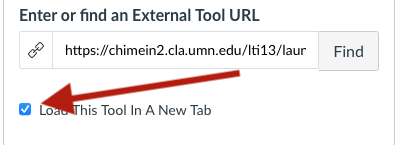
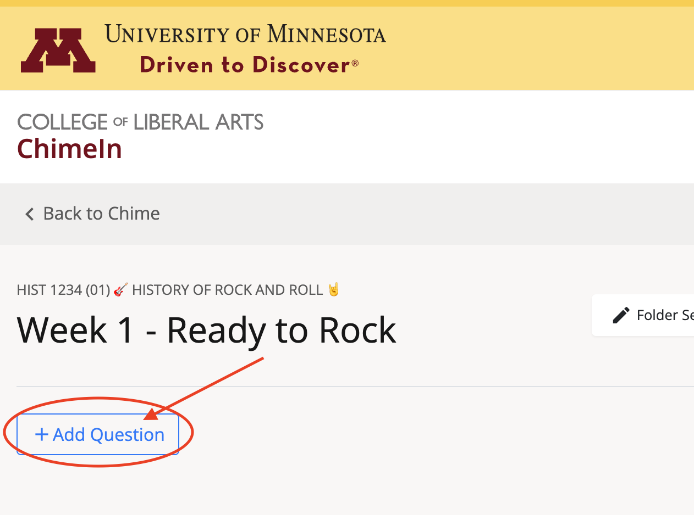

# Using ChimeIn in Canvas

ChimeIn has direct Canvas integration, which makes it easy to create and manage Chimes. In addition, ChimeIn can share completion data back to the Canvas gradebook, allowing ChimeIn responses to be used to track attendance or participation.

We have a screencast embedded in this help page, if you'd prefer to follow along that way.

::: tip Changes for Summer/Fall 2022
If you've used ChimeIn with Canvas in the past, you might remember going through a step of adding ChimeIn to your course in your Canvas settings. That's no longer necessary - you can start using ChimeIn immediately.
:::

## Adding a ChimeIn Assignment in Canvas

ChimeIn is available as an "external tool" within the Canvas assignment tool. The screencast below shows the process for creating assignments with ChimeIn, and using ChimeIn within your Canvas course.

<iframe width="100%" height="420" src="https://www.youtube.com/embed/Wf9YrZ1FAqw" frameborder="0" allow="accelerometer; autoplay; encrypted-media; gyroscope; picture-in-picture" allowfullscreen></iframe>

### Step by Step instructions

Below is a set of a step-by-step instructions for making a ChimeIn assignment in Canvas.

| Step                                                                                                                                   |                                         Screenshot                                          |
| -------------------------------------------------------------------------------------------------------------------------------------- | :-----------------------------------------------------------------------------------------: |
| Add a new assignment within Canvas                                                                                                     |                                              |
| Set a point value and grading basis if you'd like                                                                                      |                                                         |
| Set "Submission Type" to "External Tool"                                                                                               |                                              |
| Click "Find"                                                                                                                           |                                                              |
| Select "ChimeIn" in the list and click **Select**                                                                                      |                                                       |
| Check the box for "open in a new tab" (**important**)                                                                                  |                                                   |
| Verify that Submission Attempts is set to "Unlimited"                                                                                  |  |
| Click "save" at the bottom of the page                                                                                                 |                                                        |
| Click the "load" button to open ChimeIn                                                                                                |                                                                    |
| Add your questions within ChimeIn. If you have co-instructors, they will automatically be granted the access to add questions as well. |             |
| **Don't forget to publish your assignment** when you're ready for your students to view it                                             |                                                                |

## Gradebook integration options

When you first setup ChimeIn in Canvas, you'll be asked to select how you'd like ChimeIn to appear in the gradebook. You've got two options - you can either have a single gradebook entry for all of your ChimeIn responses, or you can have multiple assignments each with its own gradebook entry. You can also choose not to have any grades.

## Approaches to using ChimeIn within Canvas

If you're using ChimeIn repeatedly throughout a course, there are a couple different approaches to setting up your Canvas course. If you'd like to keep track of student participation on a weekly or per-lecture basis, you should create separate assignments. Just repeat the steps in the previous section each time. That way, the gradebook will reflect participation in individual course sessions. Alternatively, you can create a single assignment for an entire semester, and collect an overall grade. If you'd like to discuss different approaches, just [contact us](mailto:latistecharch@umn.edu).

## Presenting to students

When you're ready to share your questions with your students, remind them to follow the assignment link within Canvas. **This is important in order for them to receive credit in the gradebook.** As the instructor, you can follow the same link to present the questions. At that point, the process is the same as presenting ChimeIn outside of Canvas. We've got a [step by step cheatsheet you can refer to](cheatsheet).

ChimeIn grades will be updated in Canvas approximately 3 hours after the last response is received. This is done to ensure that students don't get flooded with "grade update" notifications during a class. You can also use the "Force Canvas Sync" button, available under "Chime settings" or "Folder Settings" to force an instant update.

::: tip Student View  
The "Student View" option in Canvas won't work with a third party tool like ChimeIn. To see exactly what your students will see, you can use the "participant view" button in ChimeIn.
:::

## "Correct" answers and the gradebook

ChimeIn is most often used to check engagement or collect feedback on a topic, rather than as a substitute for a quiz tool. However, when using multiple choice questions, you can choose to mark some responses as "correct". In your [Chime settings](managing-a-chime), you can choose to only count correct answers towards grades in Canvas.

## Cloning a Canvas course

If you've cloned a Canvas course from a previous semester, and would like to re-use your ChimeIn questions, simply click on one of your ChimeIn assignments. ChimeIn will ask if you'd like to import the questions and folders from a previous Chime.

We recommend click through each of your ChimeIn assignments from Canvas to ensure they're linked correctly, but that should generally happen automatically.
