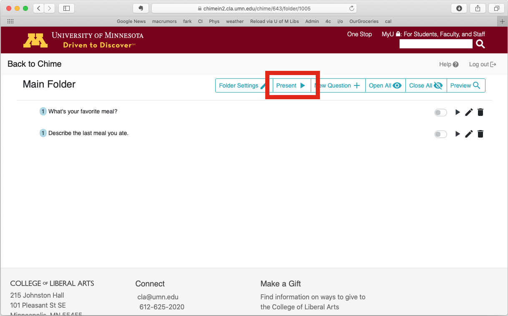
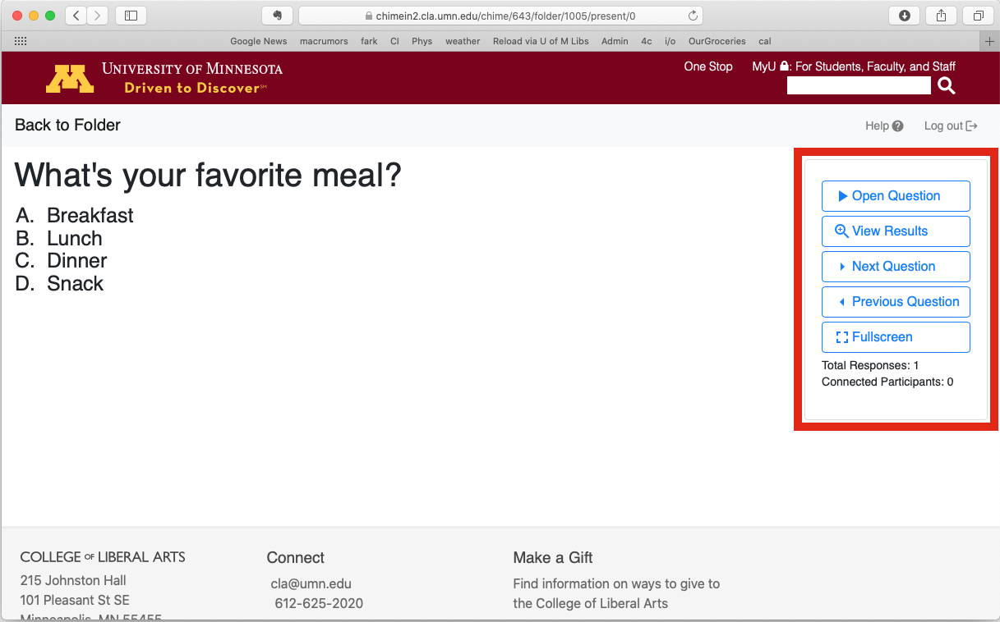

# ChimeIn 2 Cheatsheet

Need a quick reminder about how to use ChimeIn when it comes time to actually ask questions? This page is an in-the-moment cheatsheet for you.

## Tips and Reminders for Everyone

* **Students can only see questions that are "open"**. You can open questions either from the folder view (open questions have a "green" switch icon) or from "present" view. 
* Clicking the "Participant View" button will show you exactly what your students are seeing.
* If you're doing a "free response" question and a word appears in the cloud that you'd like to filter out, just click on it
* If you'd like to have entire phrases appear in the word cloud, ask students to put phrases in quotes ("this is my answer" will be treated as one term in the cloud, whereas without the quotes each word would appear individually)

## If you're using ChimeIn with Canvas

The most important thing to remember when using ChimeIn with Canvas is to **always access ChimeIn via the links in Canvas**. This is true for both instructors and students. Go to your Canvas page, go to Assignments, and click your ChimeIn assignment.

Here's a step by step guide for instructors:

1. Tell your students to head to Canvas and click on your ChimeIn assignment (you might have more than ChimeIn entry - remind them to use the correct link for this week or lecture)
2. Go to Canvas in your own browser and click the appropriate ChimeIn link
3. Click the "**present**" button (figure 1 below)
4. Click the "**open question**" button when you're ready to ask a question. As soon as you click "open question," it'll appear for your students. (figure 2 below)
5. Click the "**view results**" button to show results. This will update live as responses come in.
6. When you're done accepting responses, click "**close question**".
7. Use "**next question**" and "**previous question**" to move through your questions. 

<figure align='center'>

 <figcaption><i>Figure 1</i> Present Button</figcaption>
</figure>

&nbsp

<figure align='center'>

<figcaption><i>Figure 2</i> Question Controls</figcaption>
</figure>

## If you're using ChimeIn on its own (outside of Canvas)

Every chime has its own unique URL. Go to [chimein2.cla.umn.edu](http://chimein2.cla.umn.edu) and click on your chime. Then click "**Chime Settings**". Look for the link that says **Participants can join by visiting**. Anyone you give that link to will be able to join your Chime. When you're ready to ask questions, ask your participants to access that URL. 

1. Ask your participants to visit the unique URL you found above
2. Go to [chimein2.cla.umn.edu](http://chimein2.cla.umn.edu) and click on your Chime, then click on the folder that contains the questions you want to ask.
3. Click the "**present**" button
4. Click the "**open question**" button when you're ready to ask a question. As soon as you click "open question," it'll appear for your students.
5. Click the "**view results**" button to show results. This will update live as responses come in.
6. When you're done accepting responses, click "**close question**".
7. Use "**next question**" and "**previous question**" to move through your questions. 