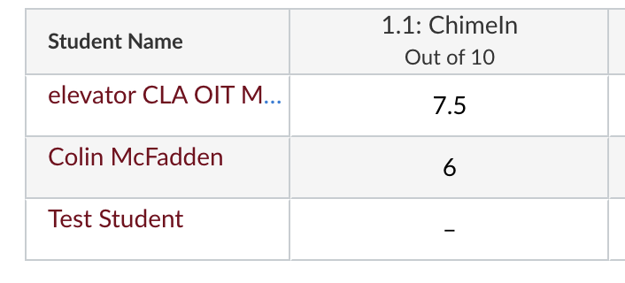

# FAQ: Canvas Grading

How can I manually adjust ChimeIn grades?

You might have a student with an excused absence, or may want to round up some ChimeIn grades. You can tweak ChimeIn grades in the Canvas gradebook a couple of different ways:

### Edit Canvas Grades Directly

Probably the easiest to **edit the grades directly** in the Canvas gradebook, with a few caveats. ChimeIn automatically re-syncs assignments a few hours after any new responses, so be sure to close questions to avoid new responses which will overwrite your edits.

For example, I could type "ex" in the grade column to excuse a student from the ChimeIn assignment:

   

> [!IMPORTANT]
> ChimeIn will resync an assignment if there are any new responses, so wait
> until all your responses are in and your question is closes before making
> adjustments.

### Separate Column for Adjustments

Another option is to **create a separate grade column** specifically for any ChimeIn point adjustments, and then assign points as needed to that column. Since this is a separate column, you don't need to worry about ChimeIn syncing overwriting your changes.

   

  
How can I round up assignment scores to 100%?

You can use [Curve Grades](https://community.canvaslms.com/t5/Instructor-Guide/How-do-I-curve-grades-in-the-Gradebook/ta-p/745) in Canvas to do the adjustment.

This will give any participation full points, and non-participants a zero:

| Before                                                                                                                          | After                                                                                         |
| ------------------------------------------------------------------------------------------------------------------------------- | --------------------------------------------------------------------------------------------- |
|  |  |

1. Go to Your Course > Grades.
2. Find the ChimeIn assignment you wish to adjust, and click the &vellip; next to the assignment name.
3. Choose "Curve Grades" from the menu:
   
4. Set your curve average as full points (e.g. 10/10), and check the assign 0's to non-participants box.
   
5. Apply the settings by clicking the "Curve Grades" button.

How can I drop lowest ChimeIn assignment scores?

If you set up a ChimeIn assignment for each class meeting in Canvas, you may want to permit students to miss a certain number of before it impacts their grades.

You can use [Canvas assignment groups](https://community.canvaslms.com/t5/Instructor-Guide/How-do-I-add-an-assignment-group-in-a-course/ta-p/970) to group all your chime assignments together, and then [create a rule to drop the lowest X chimes](https://community.canvaslms.com/t5/Instructor-Guide/How-do-I-create-rules-for-an-assignment-group/ta-p/848).

Here's a demo:

<iframe width="100%" height="420" src="https://www.youtube.com/embed/RXczYrezKmY" title="YouTube video player" frameborder="0" allow="accelerometer; autoplay; clipboard-write; encrypted-media; gyroscope; picture-in-picture" allowfullscreen></iframe>

How long does it take for ChimeIn to sync grades with Canvas?

ChimeIn will automatically sync any assignment with new responses **3 hours after the last response**.

 
  
How can I manually resync grades in Canvas with ChimeIn?

You can manually resync grades in ChimeIn.

If you setup ChimeIn for **Multiple Grade Columns (default)**:

1. Go to [ChimeIn](https://chimein.cla.umn.edu) and choose your course.
2. Choose the folder (assignment) you wish to sync.
3. Within the folder, click **Folder Settings** to open the settings menu, then choose **Force Sync with Canvas**:

  

If you setup ChimeIn for **One Grade Column**

1. Go to [ChimeIn](https://chimein.cla.umn.edu) and choose your course.
2. Choose **Chime Settings** to open the settings menu, then click **Force Sync**:

  

