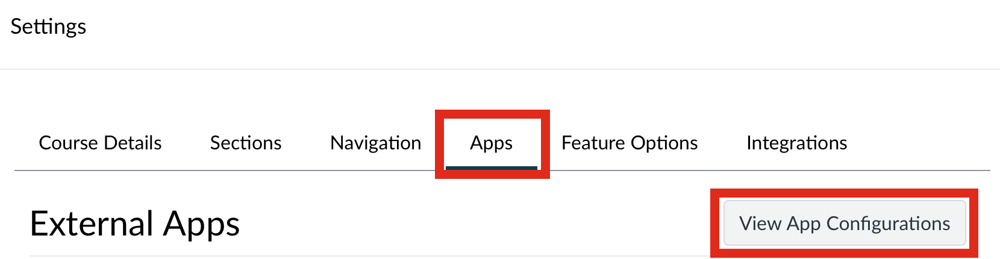
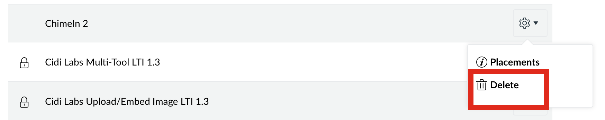
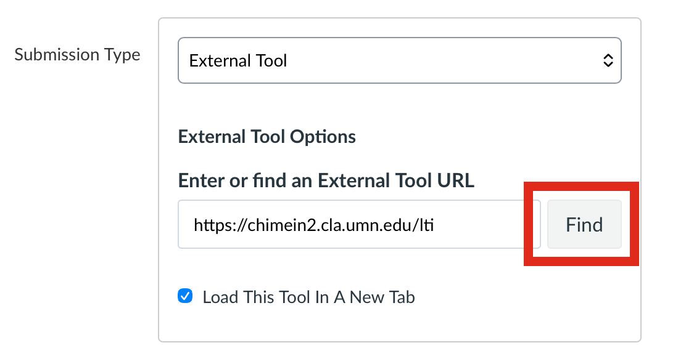
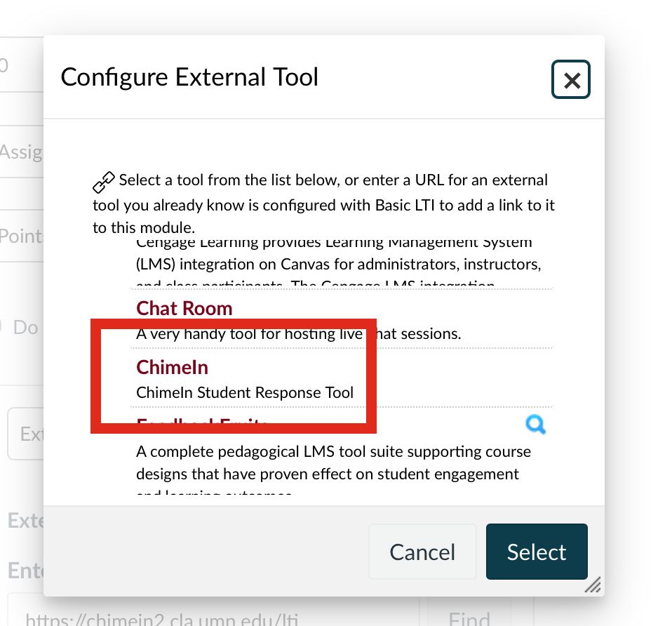

# Updating Canvas to LTI 1.3

When older Canvas courses are cloned, they can bring forward ChimeIn configurations that use an older technology called LTI 1.1. The University has phased out support for this technology, so courses need to be updated to use a newer, more secure standard called LTI 1.3. The steps below walk you through updating your course.

## Remove the older integration
In your course settings, open the **Apps** tab, then click **View App Configurations**.

Scroll down and find an entry labeled **ChimeIn 2** with a gear icon. You may have multiple copies listed. Click the gear icon, then click **Delete Placement**.

## Update assignments

Edit each of your ChimeIn assignments and find the **External Tool** box. Click **Find**.

In the external tools list, select **ChimeIn**, then click **Select**.

Save the assignment. Repeat this process for all of your ChimeIn assignments.

Finally, click through one of your assignments. This will trigger the ChimeIn configuration page.

