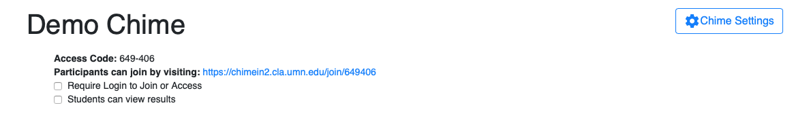

# Migrating to ChimeIn 2

ChimeIn 2 works a little differently from the original version.  The biggest change is that ChimeIn 2 no longer relies on course enrollment data to provide access.  Historically, this has been the biggest pain-point for faculty - enrollment data can be out of date or incorrect, and it could be complicated to track down issues.  

ChimeIn 2 also uses some new language.  ChimeIn has been used in many non-course situations, so the course-centric interface created confusion.  In ChimeIn 2, you create _chimes_.  Chimes contain folders, and folders contain questions.  You'll never enter a "course designator" or any other course-specific information. 

## Using ChimeIn 2 with a course ##

We're currently testing our [Canvas](/canvas) integration, which dramatically simplifies using ChimeIn with a course.  Although that's not yet available for everyone, you can still use ChimeIn with a course.  

Begin by creating your Chime, adding at least one folder, and some [questions](/asking-questions). From the Chime page, click the "Chime Settings" button. 

### Access Code ###

The "access code" provides a six digit code which can be used to join your Chime.  Participants just need to visit [chimein2.cla.umn.edu](http://chimein2.cla.umn.edu) and enter the access code in the box on the right side of the screen.  If you've checked the "Require Login to Join or Access" box, users will need to log in to their University account to complete the join process.

### Unique Link ###

You can also use the unique link in the Chime settings ("Participants can join by visiting") to automatically connect participants with your Chime.  This link can be placed on a Canvas website, distributed via email, or linked to via a "[Z](http://z.umn.edu)" link.  When a participant clicks the link, they'll be taken straight to your Chime and can begin participating. 

## Other Changes with ChimeIn 2 ##

The process for using ChimeIn 2 to ask questions is very similar to the original version.  Participants just leave their browser open on page for your Chime and questions will appear automatically when you "open" them.  ChimeIn 2 provides a "present" mode which can be used fullscreen, to better facilitate asking questions in class.  